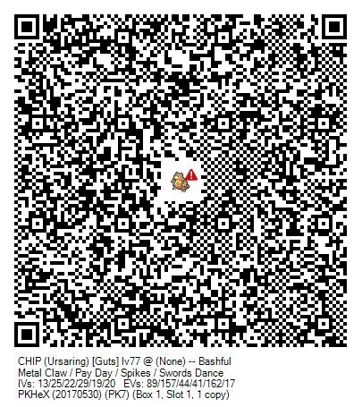
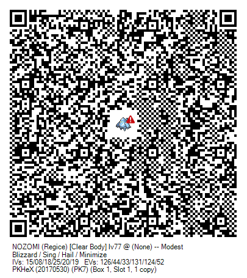

## Chad's Pokémon

Below is a list of Chad's Pokémon and a link to the SiIvaGunner wiki for each reference.

- [Angry Joe](http://siivagunner.wikia.com/wiki/Angry_Joe)
- [Chip](http://siivagunner.wikia.com/wiki/Chip_tha_Ripper)
- [Grand Dad](http://siivagunner.wikia.com/wiki/Grand_Dad)
- [Loud Nigra](http://siivagunner.wikia.com/wiki/Loud_Nigra) - (Warning: Potentially NSFW. Do not view at work or any place where it may give you repercussions.)
- [Smol Nozomi](http://siivagunner.wikia.com/wiki/Smol_Nozomi)
- [snop](http://siivagunner.wikia.com/wiki/Snoop_Dogg)

Additionally, below I have the PK3 files linked for PKHeX and the QR codes to inject them into Sun and Moon using SciresM's patcher. You can use the PK3 files in PKHeX to import them into your own save (does NOT have to be FireRed, this can be any game, it does not even neccesarily have to be F/G/R/S/E.) The QR codes are generation 7 specific.

|---
| PK3 file | QR Code |
|---:|---:|
| [ANGRY JOE.pk3](chad/ANGRY%20JOE.pk3) |  |
| [CHIP.pk3](chad/CHIP.pk3) |  |
| [GRAND DAD.pk3](chad/GRAND%20DAD.pk3) |  |
| [LOUD NIGRA.pk3](chad/LOUD%20NIGRA.pk3) |  |
| [NOZOMI.pk3](chad/NOZOMI.pk3) |  |
| [snop.pk3](chad/snop.pk3) |  |
|---
